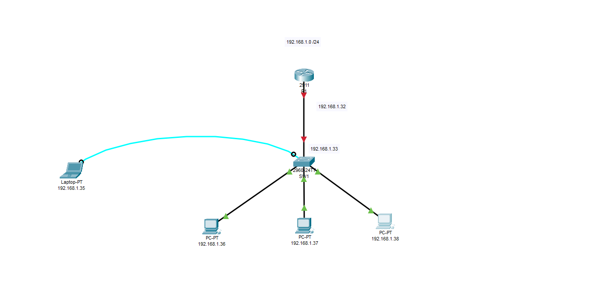

# Configuration
 Vlan,Password, Hostname,Logging
 
 
 
 

 
 <b>Privilege mode</b> --> entry  
 <b>Console</b> --> console  
 <b>Telnet</b> --> telnet  
 <b>Hostname</b> --> SW1, R1, SW2 ...  
 <b>Vlan</b> 192.168.1.0 /27 255.255.255.224  
 3x PCs

 
 loggig sychnronous  
 time out  10 min
 no ip domain-lookup  
 
 ### Switch 1 
 
 ```
 enable
 configure terminal
 hostname SW1
 no ip domain-lookup
 interface Vlan1
ip address 192.168.1.33 255.255.255.224
no shutdown
exit
ip default-gateway 192.168.1.32
enable password plain
enable secret entry
line console 0
password console
login
logging synchronous
exec-timeout 10
exit
line vty 0 15
password telnet
login
exit
copy running-config startup-config
reload
```

### Test
<b>Console</b>   
laptop --> Desktop 192.168.1.35 /255.255.255.0 / 192.168.1.32  
Laptop --> Terminal --> Login  

<b>Telnet</b>  
PC1 --> Desktop 192.168.1.36 / 255.255.255.0 / 192.168.1.32  
PC1 --> Command Promt C:\>telnet 192.168.1.33 --> Login  

<b>Translating</b>
```
SW1#dns
Translating "dns"
% Unknown command or computer name, or unable to find computer address
```

<b>Password</b>
```
SW1#show running-config 

no service password-encryption
!
hostname SW1
!
enable secret 5 $1$mERr$l.TS7YSygGtJpW54t.bD4.
enable password plain
!
no ip domain-lookup
!
interface Vlan1
 ip address 192.168.1.33 255.255.255.224
!
ip default-gateway 192.168.1.32
!
line con 0
 password console
 logging synchronous
 login
!
line vty 0 4
 password telnet
 login
line vty 5 15
 password telnet
 login
 ```
 
 
 ### Add Users
 
 
 <b>user</b> Tyler <b>password</b> blue  
 <b>user</b> Martin <b>password</b> white  
 <b>user</b> Ivan <b>pasword</b> red  
 
 ```
 enable
 configure terminal
 username Tyler password blue
 username Martin password white
 username Ivan password red
 ```
 
 ### Test user
 
 PC --> Command Promt C:\>telnet 192.168.1.33 --> Login --> Tyler, Martin  
 Laptop --> Terminal --> Login --> Ivan  
 
 
 ### Encryption
 
 ```
SW1#show running-config | include enable|user|telnet|console
enable secret 5 $1$mERr$l.TS7YSygGtJpW54t.bD4.
enable password plain
username Ivan privilege 1 password 0 red
username Martin privilege 1 password 0 white
username Tyler privilege 1 password 0 blue
 password console
 password telnet
 password telnet
 ```
 
 ### Set up encryption
 
 ```
 enable
 configure terminal
 service password-encryption
 exit
 ```
 
 ### Test
 ```
 show running-config | include enable|user|telnet|console
 SW1#show running-config | include enable|user|telnet|console
enable secret 5 $1$mERr$l.TS7YSygGtJpW54t.bD4.
enable password 7 0831404F0017
username Ivan privilege 1 password 7 0833494A
username Martin privilege 1 password 7 083644471D1C
username Tyler privilege 1 password 7 0823405B0C
```
 
 
 
 
 